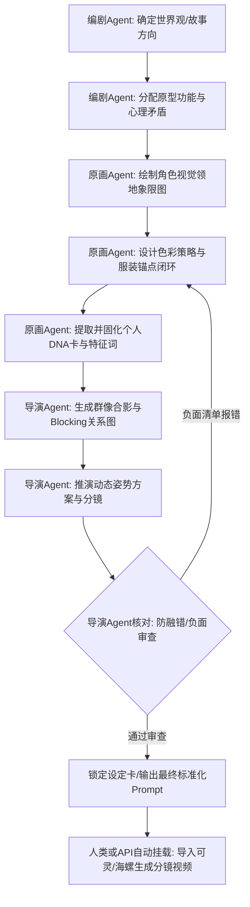

# 完整设计流程

---

## 10步从零到生成

> 以"外卖骑手老林"为例的完整流程演示。

### Step 1: 确定受众和原型

**分析**：
```
受众：30-45岁男性，蓝领
- 他们经历过生活压力
- 他们理解底层人的挣扎
- 他们有代入感

原型选择：
- Hero（挣扎）：在系统压迫下挣扎
- Shadow（社会压迫）：外卖平台、顾客、城市
- Ally（同行兄弟）：同事小赵
```

**输出**：
```
角色定位：城市底层的挣扎者
原型：Hero + Shadow + Ally
受众：蓝领工人/30-45岁男性
```

---

### Step 2: 群像设计（防止融合）

**设计三人组**：
```
老林（主角）：外卖骑手
- 色彩：深蓝工作服（低饱和冷色）
- 体型：偏瘦但结实
- 符号：黄色头盔（唯一的暖色）

小赵（配角）：同事
- 色彩：黄色骑手服（高饱和暖色）
- 体型：更壮
- 符号：开朗性格

老板娘（配角）：商家
- 色彩：红色围裙（暖色点缀）
- 体型：丰满
- 符号：市井气
```

**色彩隔离检查**：
```
深蓝/黄/红 = 完全不同的色彩象限
三人色彩远看可区分 ✓
```

---

### Step 3: DNA标签卡建立

**完整DNA**：
```
【老林】
- 面部几何：方脸/颧骨高耸/眉毛粗黑/眼睛小而狠/鼻梁挺直/嘴唇紧抿/下巴方正
- 体型：身高175cm/肩宽/偏瘦但结实/重心稳定
- 姿态习惯：微微驼背/重心偏向电动车/站姿稳健但有压迫感
- 服装：深蓝色骑手服/黄色头盔/黑色雨靴
- 色彩锚点：深蓝（主）/黄色（点缀）/黑色（辅）
- 标志性细节：右眉有一道旧伤疤/左手无名指有老茧
```

---

### Step 4: 姿态/表情/色彩系统

**姿态签名**：
```
日常态：微微驼背/重心偏向电动车/表情冷漠
紧张态：身体前倾/拳头紧握/眉头紧锁
愤怒态：眉心皱缩/嘴角下压/身体僵硬
```

**情绪联动矩阵**：
| 情绪 | 眼睛 | 眉毛 | 嘴巴 | 姿态 |
|------|------|------|------|------|
| 平静 | 正常 | 水平 | 横线 | 微微驼背 |
| 愤怒 | 缩小 | 上扬+30° | 下压 | 前倾 |
| 悲伤 | 下垂 | 下压 | 下弯 | 内收 |
| 压力 | 缩小 | 皱 | 抿紧 | 僵硬 |

**色彩叙事**：
```
黄色头盔 = 唯一的暖色
= 希望
= 家庭
= 老林人性最后的痕迹
```

---

### Step 5: 一致性锚定

**三件套参考图**：
```
1. 正脸图：方脸/颧骨高/眉疤/深蓝工作服
2. 侧脸图：90°侧脸/颧骨轮廓/眉疤
3. 全身图：驼背姿态/黄色头盔/电动车旁
```

**镜头锚定规则**：
```
每个镜头必须包含：
□ 位置：左1/3/右1/3/中央
□ 景别：远/中/近/特
□ 视线：看哪里/看谁
□ 光源：45°侧光（锁定）
□ DNA：每次提及面型/服装/色彩
```

---

### Step 6: Blocking设计

**对峙场景**：
```
位置：
- 老林：左1/3
- 老板娘：右1/3

视线：
- 老林看老板娘（压力/愤怒）
- 老板娘看老林（不耐烦）

距离：
- 两人之间一个半身位
- 中间留白 = 张力空间

光源：
- 统一：左上方45°侧光
```

---

### Step 7: 分镜Prompt生成

**镜头1（特写）**：
```
老林面部特写，
愤怒表情：眉心皱缩/眼睛缩小/嘴角下压，
DNA：方脸/颧骨高/右眉旧伤疤，
光源：左上方45°侧光，阴影在右脸，
景别：特写（只露脸部），
比例：16:9，
即梦，写实风格
```

**镜头2（中景）**：
```
老林骑电动车，中景，
姿态：微微驼背/右手握车把/重心偏左，
服装：深蓝色骑手服/黄色头盔在画面左侧可见，
光源：左上方45°侧光，
景别：中景（膝盖以上），
比例：16:9，
即梦，写实风格
```

**镜头3（全景）**：
```
老林+小赵+老板娘，三人同框，
老林在左1/3/小赵在右1/3/老板娘在后景中央，
老林：深蓝工作服/驼背/视线看老板娘，
小赵：黄色骑手服/身体舒展/视线看老林，
老板娘：红色围裙/叉腰/视线看老林，
三人形成三角站位，
光源：统一侧光，
景别：全景，
比例：16:9，
即梦，写实风格
```

---

### Step 8: 迭代优化

**检查流程**：
```
每镜输出后检查：
□ 面部一致？（对比正脸图）
□ 服装色彩一致？（深蓝色？）
□ 眉疤是否保留？
□ 光影方向一致？（45°侧光？）
□ 位置关系一致？

失败 → 返回Step 7重新生成
通过 → 下一镜
```

---

### Step 9: 锁定设定卡

**最终交付物**：
```
1. 老林角色卡（PDF/图片）
   - 三件套参考图
   - DNA标签卡
   - 色彩锚点
   - 姿态签名

2. 场景 Blocking图
   - 关键镜头位置图
   - 光源方向图

3. Prompt库
   - 所有镜头的Prompt
   - 变体Prompt
```

---

### Step 10: 进入正式分镜制作

```
产出物 → 交给导演 → 用于分镜 → 进入视频生成
```

---

## 工作流程图及 Agent 分工映射 (Agent Orchestration)

> 当引入多智能体协作框架后，以下流程步骤可直接映射给具体的 AI 角色（Agent）执行。



---

## 与其他技能的衔接

```
创意总监 → character-design（接收角色DNA）→ 导演（分镜用角色）
screenwriter → character-design（角色七情模型）
prompt-engineer → character-design（角色DNA编译）
scene-design → character-design（场景与角色关系）
```

---

## 知识库参考

必须参考：
- `~/wiki/` — 共享知识库（特别是视觉设计/色彩分类）
- `scene-design`技能 — 分镜中的视线Match/Blocking
- `prompt-engineer`技能 — 平台实测参数（即梦/可灵/海螺）

---

## 完整案例：外卖骑手老林

### 角色设定卡

```
【老林】外卖骑手，40岁

【外貌特征】
- 面部特征：方脸/颧骨高耸/眉毛粗黑/眼睛小而狠/鼻梁挺直/嘴唇紧抿/下巴方正
- 发型：短发/左边分/有白发
- 服饰：深蓝色骑手工作服/黑色雨靴/黄色头盔
- 体型：身高175cm/肩宽/偏瘦但结实/微微驼背

【职业/攻击特性】
- 职业：外卖骑手
- 行为风格：在城市中穿梭/与时间赛跑/忍辱负重

【核心技能】
- 骑行：熟练驾驶电动车/穿梭小巷
- 忍让：面对顾客刁难忍耐/压抑愤怒

【武器/道具】
- 电动车：破旧的黑色电动车
- 头盔：黄色，最重要的财产

【性格/风格】
- 基本性格：沉默/压抑/坚韧
- 价值观：为了家庭忍辱负重
- 行为风格：能忍则忍/但底线不可触碰
- 特殊状态：
  * 平静：眉头舒展/驼背
  * 愤怒：眉心皱缩/嘴角下压
  * 压力：身体僵硬/拳头紧握

【视觉基准锁定】
- 整体画风：写实/城市写实
- 色彩基调：深蓝/黄/黑
- 光影效果：侧光/硬光
- 标志性细节：右眉旧伤疤

【动态签名】
- 招牌动作：微微驼背靠在电动车上
- 帧数方案：6-12帧/动作
- 预备动作：后退蓄力/下沉蓄力
```

---

## 常见问题与解决

### 问题1：角色不够差异化

**解决**：
```
□ 检查色彩是否在同一色相
□ 检查体型是否太接近
□ 检查姿态是否都是站桩
□ 添加色彩隔离/体型差异/姿态签名
```

### 问题2：角色容易变脸

**解决**：
```
□ 检查DNA描述是否完整
□ 检查参考图是否一致
□ 检查每次Prompt是否都写DNA
□ 增加标志性细节描述
```

### 问题3：群像混乱

**解决**：
```
□ 检查位置是否明确（左/中/右/前/后）
□ 检查视线是否打架
□ 检查色彩是否可远距离区分
□ 拆分镜头/减少同屏人数
```

---

## 设计时间参考

| 角色复杂度 | 设计时间 | 说明 |
|------------|----------|------|
| 单主角 | 2-4小时 | 只需要设计主角 |
| 2-3人组合 | 4-8小时 | 需要设计群像关系 |
| 5人以上群像 | 1-2天 | 需要完整的视觉体系 |
| 复杂世界观 | 1周+ | 需要完整IP设计 |

---

## 角色设计质量评估标准

### A级标准（可直接用于生产）

```
□ 三件套参考图齐全（正脸/侧脸/全身）
□ DNA标签卡完整度 ≥ 90%
□ 色彩锚点明确（主色/辅色/点缀色）
□ 姿态签名独特且可执行
□ 原型叠加 ≥ 2个
□ 无重大设计缺陷
□ 群像色彩可区分
```

### B级标准（需要小幅修改）

```
□ 三件套参考图缺1-2张
□ DNA标签卡完整度 60-89%
□ 色彩锚点部分缺失
□ 姿态签名不够独特
□ 原型叠加 = 1个
□ 有1-2个小问题但可修复
```

### C级标准（需要重新设计）

```
□ 参考图严重缺失
□ DNA标签卡完整度 < 60%
□ 色彩锚点完全不明确
□ 姿态签名与其他角色混淆
□ 原型叠加为0
□ 有重大设计缺陷无法修复
```

---

## 角色设计常见问题与解决

### 问题1：角色"没有记忆点"

**诊断**：
```
□ 色彩太平庸（灰色系/肤色）
□ 姿态太标准（站桩）
□ 原型太单一
□ 没有标志性细节
```

**解决**：
```
□ 添加高饱和色彩锚点
□ 设计独特的姿态签名
□ 叠加2个以上原型
□ 添加标志性道具/细节
```

### 问题2：角色"太完美"

**诊断**：
```
□ 没有缺点/弱点
□ 没有矛盾性
□ 没有成长空间
```

**解决**：
```
□ 添加缺陷（伤疤/旧伤/习惯）
□ 添加矛盾性（强大但脆弱）
□ 设计成长弧线
```

### 问题3：角色"融入背景"

**诊断**：
```
□ 服装色彩与背景太接近
□ 光影对比不够
□ 色彩饱和度低于环境
```

**解决**：
```
□ 提高服装饱和度
□ 使用侧光分离主体背景
□ 添加色彩锚点（帽子/围巾/包）
```

### 问题4：群像"分不清谁是谁"

**诊断**：
```
□ 色彩太接近
□ 体型太相似
□ 位置关系不明确
```

**解决**：
```
□ 每个角色分配专属色彩
□ 体型差异化（高/矮/胖/瘦）
□ 明确位置关系（左/中/右）
□ 使用视线引导
```

---

## 角色设计检查清单（最终版）

### 面部特征

```
□ 脸型描述清晰（圆/方/椭圆/瓜子）
□ 颧骨高/低
□ 眉形（粗/细/弯/直）
□ 眼形（大/小/凤眼/圆眼）
□ 鼻形（高/低/鹰钩/蒜头）
□ 嘴形（大/小/薄/厚）
□ 下巴（尖/方/圆）
□ 特殊标记（疤/痣/纹身）
```

### 体型数据

```
□ 身高（具体数值）
□ 肩宽（宽/窄）
□ 体型（瘦/正常/壮/胖）
□ 重心位置（高/中/低）
```

### 色彩设计

```
□ 主色（具体颜色+饱和度）
□ 辅色（具体颜色）
□ 点缀色（具体颜色）
□ 色彩锚点（高饱和局部细节）
```

### 姿态设计

```
□ 站姿（挺直/驼背/重心偏向）
□ 坐姿（标准/二郎腿/瘫坐）
□ 手部习惯（插兜/抱胸/自然下垂）
□ 标志性动作（具体描述）
```

### 服装道具

```
□ 主服装（颜色+材质+款式）
□ 配件（项链/耳环/眼镜/手套）
□ 鞋子（颜色+款式）
□ 特殊道具（武器/工具/宠物）
```

### 原型设计

```
□ 原型数量 ≥ 2
□ 原型叠加有反差
□ 原型与角色弧线匹配
```

### 一致性保障

```
□ 三件套参考图齐全
□ DNA标签卡完整
□ 色彩锚点明确
□ 姿态签名独特
```
