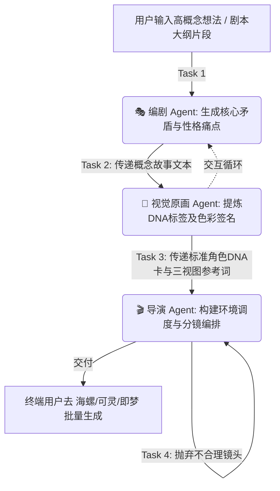

# 第十二章：多智能体协作工作流 (Multi-Agent Workflows)

> 将单打独斗的 AI 生成，升级为“虚拟影视主创班底”的流水线作业。

---

## 为什么要引入多智能体 (Multi-Agent)？

传统的内容生成往往是“用户提供要求 → 单个 AI 产出结果”。但在高度复杂的长周期角色设计与视频生成中，单个 AI 很容易出现**逻辑断层**和**设定遗忘**：
1. **难以同时兼顾感性与理性的束缚**（编剧要创意，美术要严谨的提示词约束）。
2. **缺乏相互审视与校验**，生成的瑕疵在最后一步才被发现。

通过借鉴业内成熟的多智能体编排框架（如 **CrewAI**、**MetaGPT**）以及专门的视频工作流架构（如 **NarrateX**、**ViMax**），我们可以根据本技能库的方法论，重塑一套**基于角色的协作流水线**。

---

## 核心架构：虚拟主创班底设计

在标准的多智能体角色扮演网络（Crew）中，我们通常需要配置以下三个核心节点，并让他们的输出产生严格的链式传递：

### 1. The Screenwriter（编剧 / 叙事策划）
- **核心职能**：负责从零到一的创意发散、世界观梳理、提供角色的底层心理学动机。
- **关联本库框架**：负责运用 `第一章：核心范式` 与 `第二章：角色DNA·群像/姿态叙事/原型混搭`。
- **输出物**：提供一份富有反差感、极端冲突感的【角色设定概念大纲】。

### 2. The Character Designer（角色原画师 / 视觉转化层）
- **核心职能**：将编剧天马行空的文字，严格翻译成满足 AI 生成限制的视觉锚点。
- **关联本库框架**：负责运用 `色彩暴力`、`情绪/姿态联动矩阵` 以及 `三层一致性锚定法`。
- **输出物**：提供标准化的【角色DNA标签卡】与【AI出图系统参数Prompt】。

### 3. The Director（导演 / 视觉审查调度）
- **核心职能**：在进行场景 Prompt 输出前，核对所有的视线、群像站位与故事张力；审查是否存在灾难性的设计崩塌。
- **关联本库框架**：负责套用 `第五章：角色关系Blocking` 与 `第六章：负面设计清单`。
- **输出物**：最终的【多镜头连续分镜Prompt】与【防融错审查报告】。

---

## 工作流传递 (Workflow Pipeline)

一个典型的高质量设定产出，不仅需要职责明确，而且需要**数据传递的一致性 (SOP)**：

---

## 框架实战落地参考

你可以根据自身技术栈，选择不同深度的方式落地这个多智能体流程：

### 方式 1：无代码聊天式模拟 (极简法)
直接在有“多路会话”或者强上下文对话工具中（例如 Claude Code, ChatGPT, Dify），用自然语言明确让它在一个 Session 里“分饰三角”。可以在指令中利用代码块圈定各个人物的职责（具体提示词参见 `06_AI提示词模板.md` 追加部分）。
*最适合一次性的轻量剧情短片设计。*

### 方式 2：基于 CrewAI 搭建自动化节点 (标准化法推荐)
利用 `crewai` 等框架真正创建 `Agent` 和 `Task` 实例：
- 你可以通过 `FileReadTool` 让原画 Agent 自动读取我们技能库的 `05_负面设计清单.md` 作为查杀知识库。
- 将输出设定为 JSON/Markdown 格式用于下一阶段传递。
*适合希望建立常态化的数字员工工作间、做长期视频频道的创作者。*

### 方式 3：集成式全自动框架 (例如 ViMax/NarrateX 模式)
除了设定 Agent 生成文本和标签，还将这些文本流通过代码 API 发送至视频生成节点（CogVideo 等），达成“写一段大纲，吐出一段具有一致性角色的连续视频集”。
*适合专业全自动开发团队直接用于商业化分发项目。*

---

> [!TIP]
> **多智能体协作的核心秘诀：**
> 在给下游（如原画师、导演）传递上游（如编剧）的输出时，**绝不要传递冗余的情感废话**，只传递经过结构化压缩的核心要素！AI 最容易被长篇小说绕晕而忘掉主角眼角的疤痕。
